# 3DC-git-Lecture

# Table of contents
1. [Why do we need git](#purpose)
2. [Overview of how git works](#overview)
3. [Staging / git add](#staging)
4. [Commits](#commits)
5. [Branching](#branching)
6. [Merging](#merge)
6. [Examples using commands)](#Examples-using-commands))
8. [Github / remote](#github)
    1. [Pull / Push](#github/pull-push)
    2. [Fetch / Clone](#github/fetch-clone)

## Overview of git

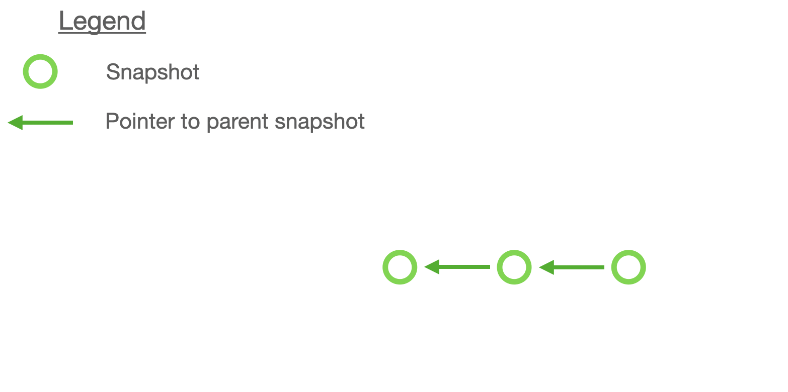
Git models the history and timeline of a bunch of files and folders using a series of snapshots. Each snapshot can be viewed as a state of the entire folder in which git is tracking. It contains information about every file and folder.

## Data Model

Git has 3 main data types:

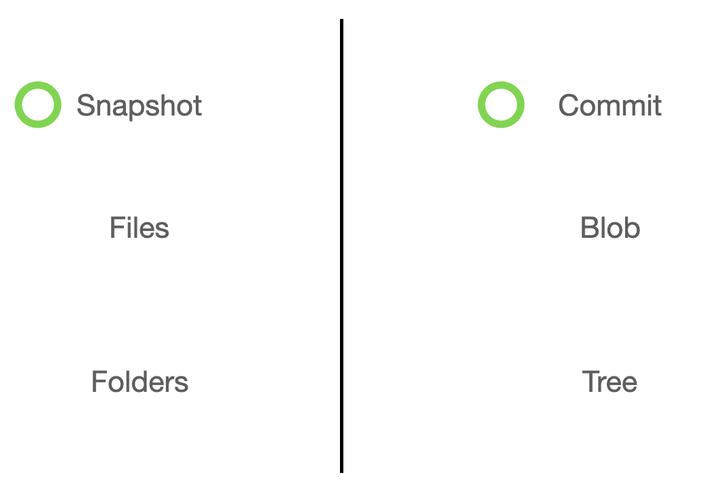
1. Blob
    Git terminology for Files
2. Tree
    Git terminology for Folders
3. Commits
    Git terminology for Snapshots

Each Commit has the following data:

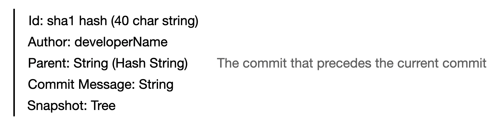
1. id
    A 40 char long String that is used to identify the commit
2. Author
    Developer name that created the commit
3. Parent
    id of the preceeding / parent commit
4. Commit Message
    Meaningful message that the developer wrote to describe the commit
5.  Snapshot
    The actual id of the tree / folder which contains files / blobs.

With each commit being able to be identified by their id. This makes identifying them difficult as the 40 long char Strings are meaningless and not useful to humans. Therefore, git uses branch names which will map a human readable String to the commit's id.

Basically a commit / snapshot can have a branch name that can be mapped to locate which commit the name refers to. 
Example as follows:

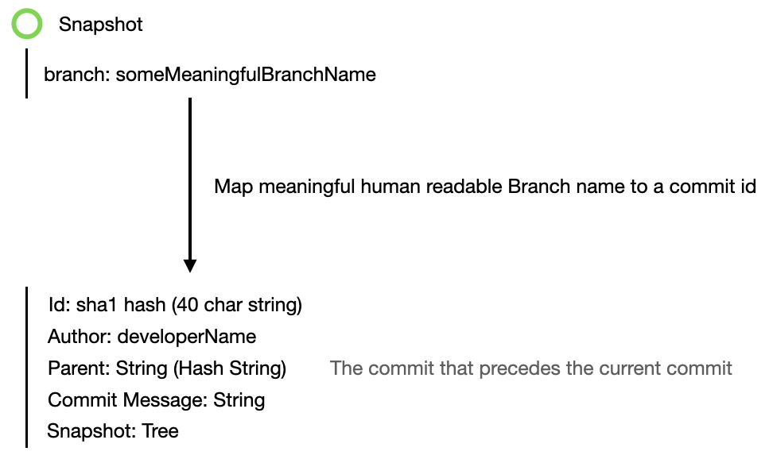

Git allows for more than 1 branch name and snapshot. This is useful when adding multiple features on your project at the same time. For example, from the current snapshot, u can create a new branch and add in the new feature while working on another branch for another independant feature. After the two features are done, you can then merge them into a single snapshot.

Branching example as follows:

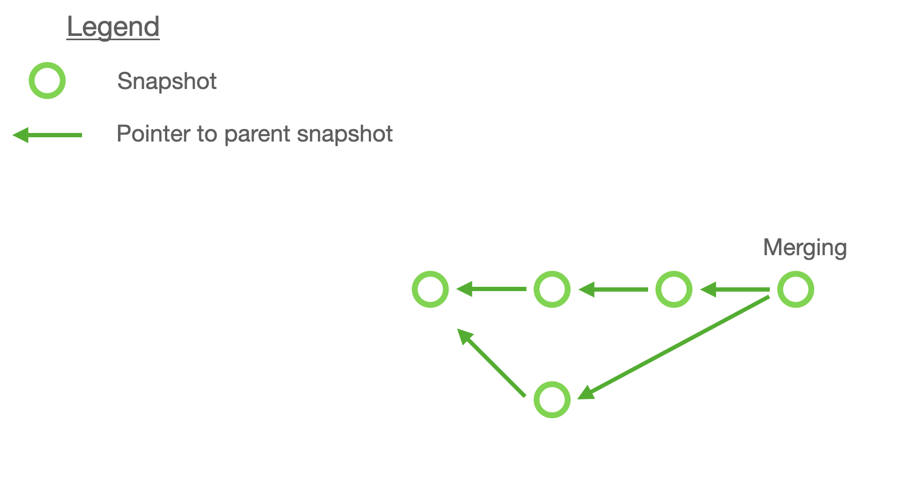

## Staging

Before moving to how to create a snapshot / making a commit. We need to understand the `git add` command. `git add` allows you to place certain files into the staging area. Files in the staging area will then be placed into a snapshot / commit when the `git commit` command is run.

This allow for clean snapshots in which you as the developer can choose how to segment your newly created or edited files into seperate snapshots / commits.

`git add` commands:
- `git add <filename>` add file into staging area
- `git add --all` add all files in all directories into staging area
- `git add .` add all files in current directory into staging area
- `git rm --cached <filename>` remove a file from the staging area

## Commits
`git commit` moves the files in the staging area into a snapshot / commit. This can be viewed as a milestone in your project, just like how you frequently save your word documents after every paragraph or what not.

`git commit` commands:
- `git commit -m "some descriptive commit message" ` Move files in staging area to a snapshot and include a descriptive message

## Branching
A branch is basically a pointer that allows for meaningful human readable text to describe a snapshot.

### main / master Branch
Everytime you inialize git, it will automatically create a branch called main or master. You can view this as the main line of development where the live code lives in.

### HEAD Branch
The HEAD branch is the branch in which points to the current Branch you are currently on.

### Commit in a branch
Since a branch is just a named pointer, whenever you commit on a different branch, git will create a new snapshot and then move the HEAD and the current branch forward to the new snapshot.

### git checkout
`git checkout` commands:
- `git checkout` switches branches.
- `git checkout -b <new branch name>` creates a new branch as per name passed in as arguement, then switches to it.

## Merging
We use `git merge` to merge branches together. 

There are 2 types of merge as follows:
- Fast Forward
    - When the branch is linear (No branching out). A fast forward merge will occur. Do remember that a branch is simply a pointer to a commit, so if it is linear, there is no need to create another commit, the branch only needs to update the pointer.

    Example as follows:

    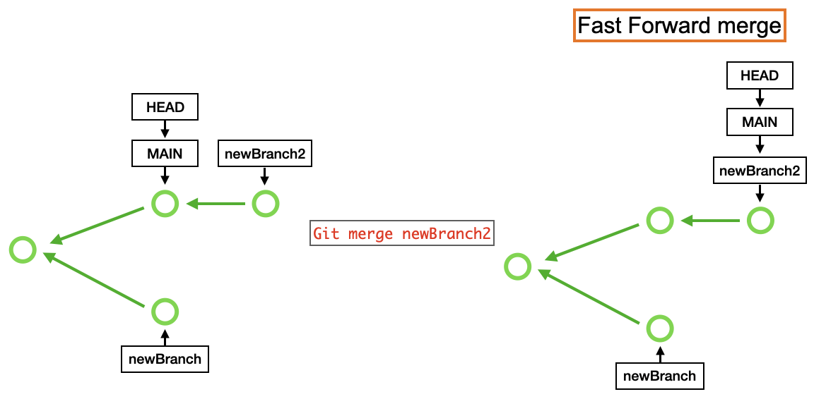

- Three way merge
    - When the commits are not linear, git will create another commit and merge the branches together.

    Example as follows:

    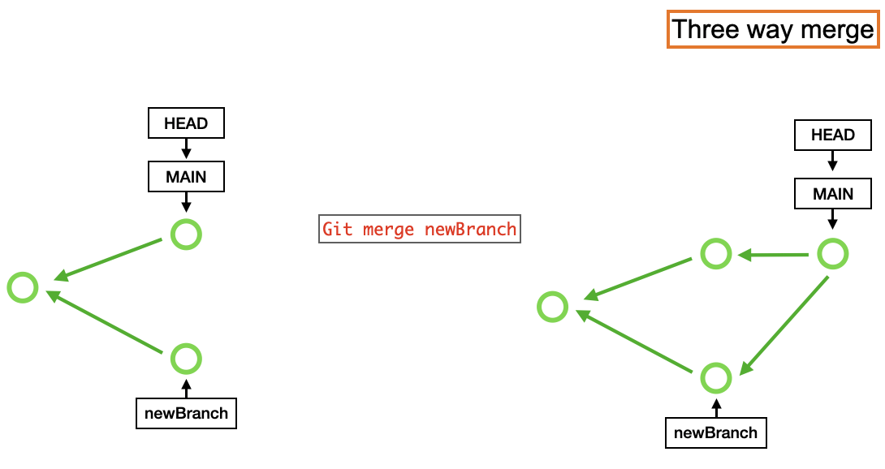

## Examples using commands we have learnt
To better illustrate how you could visualise basic git commands. We will be going through the 2 ways of merging but starting from scratch.

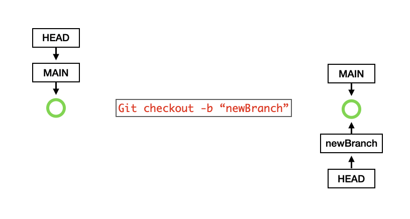

1. On our first commit, 1 snapshot in which the default branches `main / master` and `HEAD` points to. Take note `main / master` is a default branch created and `HEAD` is a pointer to show which branch you are currently on.

2. We then use `git checkout -b "newBranch" ` to create a new branch named "newBranch" and also move the `HEAD` pointer to that newly created branch. Do note that a branch is just a pointer to a commit, so creating a new branch just creates another pointer to the current commit you are on.

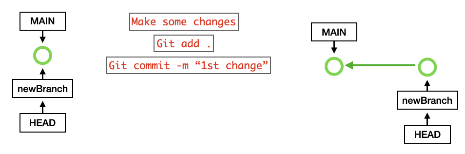

3. After making some changes, we need to use `git add .` to add all modified file from my current directory into the staging area. This is to tell git that the added files are to be tracked. After adding files we want to commit to the staging area, we use `git commit -m "1st change"`. This tells git to create a snapshot and store a meaningful commit message named "1st change". Git will then create the commit and then move the pointers `newBranch` and `HEAD` to the new commit you just created.

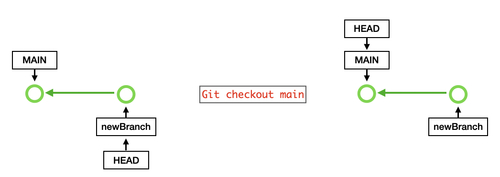

4.  Now to go back to the main branch, we use `git checkout main` to switch the HEAD pointer to the main branch.

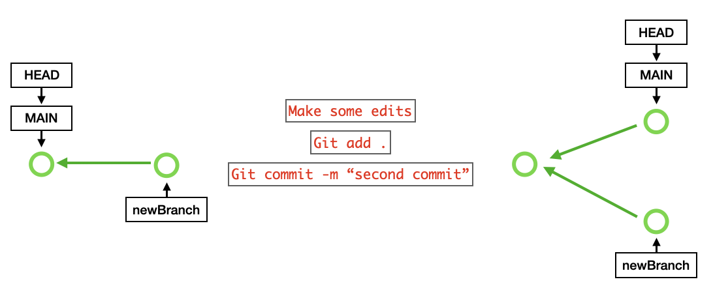

5. Now that we are on the main branch, we make more changes and do the same as previously mentioned to add modified files to the staging area then commit them with a meaningful message.

6. Now we have 2 branches with 2 different feature sets / changes. We want to merge them together. Now we run `git merge newBranch` to merge newBranch to the current branch HEAD is on which is main in this case. Git will then do a Three-way merge since there is no linear path of commits.

7. To illustrate a fast forward commit, refer to the left of the image for an example of a linear path of commits. You will realise that newBranch2 is simply some form of modification of the main branch. Therefore, git does not need to create another snapshot like what it did previously, but it only needs to update the main pointer to point to the commit in which newBranch2 points to.

## Remote / github

Git works locally on our computer, but what if we want to collaborate with other developers and would like to share the git folder. For this, we use github which hosts git folders.

To connect git to a remote git repository, we use `git remote add <name of remote> <url link of remote git repo>`