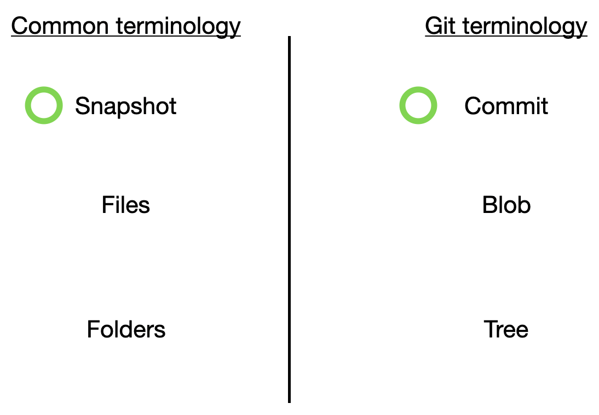

# 3DC-git-Lecture

# Table of contents
1. [Why do we need git](#purpose)
2. [Overview of how git works](#overview)
3. [Staging / git add](#staging)
4. [Commits](#commits)
5. [Branching](#branching)
6. [Merging](#merge)
7. [Github / remote](#github)
    1. [Pull / Push](#github/pull-push)
    2. [Fetch / Clone](#github/fetch-clone)

## Overview of git

Git models the history and timeline of a bunch of files and folders using a series of snapshots. Each snapshot can be viewed as a state of the entire folder in which git is tracking. It contains information about every file and folder.

In git termoinology, a snapshot is a commit, a file is a blob and a folder is a tree.

Git also allows branching out which is useful when adding multiple features on your project at the same time. For example, from the current snapshot, u can create a new branch and add in the new feature while working on another branch for another independant feature. After the two features are done, you can then merge them into a single snapshot.

## Staging

Before moving to how to create a snapshot / making a commit. We need to understand the `git add` command. `git add` allows you to place certain files into the staging area. Files in the staging area will then be placed into a snapshot / commit when the `git commit` command is run.

This allow for clean snapshots in which you as the developer can choose how to segment your newly created or edited files into seperate snapshots / commits.

`git add` commands:
- `git add <filename>` add file into staging area
- `git add --all` add all files in all directories into staging area
- `git add .` add all files in current directory into staging area
- `git rm --cached <filename>` remove a file from the staging area

## Commits
`git commit` moves the files in the staging area into a snapshot / commit. This can be viewed as a milestone in your project, just like how you frequently save your word documents after every paragraph or what not.

`git commit` commands:
- `git commit -m "some descriptive commit message" ` Move files in staging area to a snapshot and include a descriptive message

## Branching
A branch is basically a pointer that allows for meaningful human readable text to describe a snapshot.

### main / master Branch
Everytime you inialize git, it will automatically create a branch called main or master. You can view this as the main line of development where the live code lives in.

### HEAD Branch
The HEAD branch is the branch in which points to the current Branch you are currently on.

### Commit in a branch
Since a branch is just a named pointer, whenever you commit on a different branch, git will create a new snapshot and then move the HEAD and the current branch forward to the new snapshot.

### git checkout
`git checkout` commands:
`git checkout` switches branches.
`git checkout -b <new branch name>` creates a new branch as per name passed in as arguement, then switches to it.

## Merging
### Fast Forward
### Three way merge